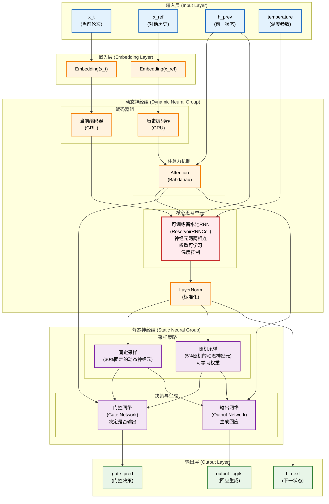

# HGD-MemNet: 分层门控对话记忆网络

本项目是 **分层门控动态记忆网络 (Hierarchical Gated Dynamic Memory Network)** 的一个 PyTorch 实现，旨在解决开放域对话系统中长程依赖的建模问题及模型的输入-输出的实时性问题。模型的核心思想是通过一个分层的门控机制，在不同的时间尺度上动态地更新和维持对话记忆。

## 核心特性

*   **分层门控记忆模型**: 核心模型 `HGD_MemNet` 包含：
    *   **动态神经组 (Dynamic Neural Group)**: 通过循环隐藏状态 `h` 捕获对话的短期记忆，在每个“思考步骤”中进行演化。动态神经组中的神经元两两相连，其中的数据会在模型启动的时候不断进行数据交换，类似蓄水池网络，但是该网络在动态神经组中的权重是可训练的，目前的训练思路是每进行一次数据交换（即一个时间步）就进行一次损失计算以及反向传播且随着对同一输入的反向传播修改的参数（即学习率）会逐步降低，这样来令模型随着思考深入逐渐靠近答案。新增：x_t 的独立 GRU 编码器、LayerNorm 和温度退火支持。
    *   **静态神经组 (Static Neural Group)**: 分为两部分一部分，一部分与固定的30%的动态神经组的神经元相连接，一部分则随机与5%数量的动态神经组的神经元相连接，用于提取整个对话历史的全局上下文表示。新增：可学习随机采样权重。
    *   **门控机制**: 一个门控单元负责在每个步骤中决策是继续“思考”（更新短期记忆）还是生成回应，当门控机制判断需要生成回应的时候想静态神经组输出一个激发，由静态神经组来输出。注：在模型生成回应的时候模型仍然会继续思考,即动态神经组仍然会继续数据交换。

## 模型架构

为了更直观地理解 HGD-MemNet 的工作流程，下图展示了其核心组件之间的数据流和分层门控机制：



## 项目结构

```
HGD-MemNet/
├── .gitignore
├── LICENSE
├── README.md
├── config.py                 # 统一的配置文件 (学习率, 路径, 模型维度等)
├── requirements.txt          # 项目依赖
├── 新的想法.txt              # 模型优化思路和创新想法
├── src/
│   ├── model.py              # HGD_MemNet 模型的核心定义
│   ├── dataset.py            # 高效的二进制数据集加载器 BinaryDialogueDataset
│   ├── train.py              # 主训练脚本
│   ├── evaluate.py           # 模型评估脚本
│   ├── chat.py               # 与训练好的模型进行交互式聊天的脚本
│   ├── chat_web.py           # Web界面聊天脚本
│   ├── utils.py              # 工具函数
│   ├── data_processing/      # 数据处理模块（所有预处理脚本集中于此）
│   │   ├── prepare_binary_data.py  # 将 .jsonl 转换为分块二进制数据的预处理脚本
│   │   ├── merge_tools.py    # 数据合并工具
│   │   ├── data_utils.py     # 数据处理工具函数
│   │   ├── debug_tools.py    # 调试和检查工具
│   │   └── vocabulary/       # 词汇表构建工具
│   │       ├── build_vocabulary.py      # 词汇表构建核心模块
│   │       ├── build_vocab_quick.py     # 快速启动脚本
│   │       └── test_vocabulary_builder.py  # 测试脚本
│   └── tests/                # 测试套件
│       ├── test_model.py     # 模型测试
│       ├── test_training.py  # 训练测试
│       └── ...               # 其他测试文件
├── examples/                 # 示例和演示脚本
│   └── attention_config_demo.py  # 注意力机制配置演示
└── 辅助脚本/
    ├── check_partial.py      # 检查部分文件
    ├── cleanup_partial_files.py  # 清理部分文件
    ├── count_processed_dialogues.py  # 统计处理的对话数量
    └── quick_count.py        # 快速计数
```

## 环境设置与使用指南

### 1. 克隆仓库

```bash
git clone https://github.com/raw-poplar/HGD-MemNet.git
cd HGD-MemNet
```

### 2. 安装依赖

建议在一个虚拟环境中安装。

```bash
pip install -r requirements.txt
```

### 3. 准备数据

1.  将您的原始对话数据集（例如 LCCC 数据集的 `train.json`, `valid.json`）放置在某个目录下。假设您放到了 `raw_data/` 中。

2.  **重要**: 修改 `config.py` 文件，更新以下路径变量以指向您的数据位置：
    *   `RAW_DATA_DIR`: 指向您存放原始数据的地方 (例如 `'raw_data/'`)。
    *   `LCCC_PROCESSED_PATH`: 指向您希望存放预处理后的二进制数据的目录 (例如 `'processed_data/'`)。

3.  **构建词汇表**: 首先需要从数据中构建词汇表
    ```bash
    # 快速构建词汇表（推荐）
    python -m src.data_processing.vocabulary.build_vocab_quick

    # 或者自定义参数
    python -m src.data_processing.vocabulary.build_vocabulary --vocab_size 30000 --min_freq 2

    # 测试词汇表构建工具
    python -m src.data_processing.vocabulary.test_vocabulary_builder
    ```

4.  运行数据预处理脚本。该脚本会读取 `RAW_DATA_DIR` 中的数据，并将其处理后保存到 `LCCC_PROCESSED_PATH`。

    #### 方法1: 使用统一入口（推荐）
    ```bash
    # 完整的数据处理流程
    python -m src.data_processing.main --full-pipeline --workers=4

    # 或者交互模式
    python -m src.data_processing.main
    ```

    #### 方法2: 分步执行
    ```bash
    # 步骤1: 数据转换
    python -m src.data_processing.prepare_binary_data --num_workers=4

    # 步骤2: 数据合并
    python -m src.data_processing.merge_tools --method=optimized --dataset=all

    # 步骤3: 验证结果
    python -m src.data_processing.merge_tools --verify
    ```

    运行完毕后，您的 `processed_data/` 目录下应该会看到 `train/`, `valid/`, `test/` 三个子目录下的 chunk_*.pt 文件或已合并的 train.pt、valid.pt、test.pt 以及词汇表 `vocabulary.json`。

### 4. 配置注意力机制（可选）

在开始训练前，您可以根据需要配置注意力机制。在 `config.py` 中修改 `NUM_ATTENTION_HEADS` 参数：

```python
# 在 config.py 中设置
NUM_ATTENTION_HEADS = 4  # 可选值: 0, 1, 或任意正整数

# 配置说明:
# 0: 纯HGD-MemNet架构（无注意力，计算效率最高）
# 1: 单头注意力（Bahdanau注意力，平衡性能和效率）
# >1: 多头注意力（现代Transformer风格，性能最佳）
```

您也可以运行演示脚本来测试不同配置：

```bash
python examples/attention_config_demo.py
```

### 5. 开始训练

直接运行训练脚本即可。脚本会自动从 `config.py` 中配置的检查点目录加载最新的检查点，并继续训练。

```bash
python -m src.train
```

注意：如果提示未找到处理后的数据，请先执行数据预处理：

```bash
python -m src.data_processing.prepare_binary_data --num_workers=4
```


提示:
- 默认启用温度退火（config.INITIAL_TEMPERATURE, TEMPERATURE_DECAY, MIN_TEMPERATURE）
- 可选启用“门控多步思考早停”：在 config.py 中设置 USE_GATED_MULTISTEP = True
- 可选切换静态头采样策略：在 config.py 中设置 USE_SOFT_TOPK_TRAINING = True/False

*   训练日志、验证损失和检查点会保存在 `config.CHECKPOINT_DIR` 指定的目录中。
*   表现最好的模型会被额外保存到 `config.BEST_MODEL_DIR`。

### 6. 评估模型

运行评估脚本来测试模型在测试集上的性能。

```bash
python -m src.evaluate
```

### 7. 与模型聊天

使用 `chat.py` 脚本与您训练好的最佳模型进行交互。

```bash
python -m src.chat  # 命令行交互

# 或者使用 Web 接口：
streamlit run src/chat_web.py  # Web 演示
```

## 词汇表构建工具

项目包含了一套完整的词汇表构建工具，用于从JSONL格式的对话数据中提取最常用的词汇。

### 主要功能

- **中文分词支持**: 使用jieba进行中文分词
- **词频统计**: 统计所有词汇的出现频率并过滤低频词
- **灵活配置**: 支持自定义词汇表大小、最小词频等参数
- **智能过滤**: 自动过滤标点符号，保留中文、英文和数字
- **详细统计**: 生成词频分布和使用统计报告

### 快速使用

**注意**: 使用前请先在 `config.py` 中配置正确的数据路径，或设置环境变量 `DATASET_PATH`

```bash
# 安装依赖
pip install jieba

# 快速构建词汇表（使用config.py中的配置）
python -m src.data_processing.vocabulary.build_vocab_quick

# 自定义参数构建
python -m src.data_processing.vocabulary.build_vocabulary \
    --data_path "你的数据路径" \
    --vocab_size 30000 \
    --min_freq 2

# 测试工具
python -m src.data_processing.vocabulary.test_vocabulary_builder
```

### 输入要求

工具需要以下三个JSONL文件：
- `train.jsonl` - 训练数据
- `valid.jsonl` - 验证数据
- `test.jsonl` - 测试数据

每行格式：`[{"text": "你好"}, {"text": "你好吗"}]`

### 输出文件

- `vocabulary.json` - 完整词汇表文件，包含词汇映射和统计信息
- `vocabulary_stats.json` - 详细的词频分布统计

更多技术细节请参考 `src/data_processing/README.md` 中的词汇表构建部分

## 改进与优化

- **训练优化**：实现了温度退火（从高到低衰减）和硬/软采样切换，以提升探索性和稳定性。
- **架构增强**：添加了 x_t 的独立编码器、可学习采样权重和 LayerNorm，以提高模型鲁棒性和效率。
- **可配置注意力机制**：支持三种注意力模式，可在 `config.py` 中通过 `NUM_ATTENTION_HEADS` 参数配置：
  - `NUM_ATTENTION_HEADS = 0`：纯HGD-MemNet架构，使用平均池化替代注意力机制
  - `NUM_ATTENTION_HEADS = 1`：单头注意力机制（Bahdanau注意力）
  - `NUM_ATTENTION_HEADS > 1`：多头注意力机制（示例：4头、8头）
- **建议**：监控温度参数，实验不同衰减率；对于大模型，考虑分布式训练。

## 原创性声明
本项目提出的 **HGD-MemNet** (分层门控对话记忆网络) 及其配套技术方案，由作者 [raw-poplar](https://github.com/raw-poplar) 原创设计并实现，若需使用请标上原作者。其核心创新点在于：

- 提出了一种新颖的分层门控动态记忆架构，包含可进行权重学习的动态神经组 (DNG) 和负责全局上下文的静态神经组 (SNG)，通过门控单元协调记忆更新与回应生成。

- 创新性地设计了动态神经组的可训练数据交换机制及其按时间步渐进式训练策略，使模型能在思考过程中逐步逼近最优解。
本项目代码、模型架构及相关技术方案均为原创成果。

## 注意力机制配置指南

### 概述

本项目实现了灵活的多头注意力机制，您可以通过简单的配置参数来控制模型的注意力行为：

- **NUM_ATTENTION_HEADS = 0**: 纯HGD-MemNet架构（无注意力机制）
- **NUM_ATTENTION_HEADS = 1**: 单头注意力（Bahdanau或多头实现）
- **NUM_ATTENTION_HEADS >= 2**: 多头注意力机制

### 配置参数详解

在config.py中的关键参数：

```python
# ------------------------------------
# 注意力机制相关参数
# ------------------------------------
# 注意力头数量 (0: 纯HGD-MemNet, 1: 单头注意力, >=2: 多头注意力)
NUM_ATTENTION_HEADS = 1

# 多头注意力相关参数
ATTENTION_DROPOUT = 0.1  # 注意力dropout率
ATTENTION_HEAD_DIM = None  # 每个注意力头的维度，None表示自动计算
USE_ATTENTION_BIAS = True  # 是否在注意力计算中使用偏置
ATTENTION_TEMPERATURE = 1.0  # 注意力温度参数

# 注意力机制类型选择
ATTENTION_TYPE = "bahdanau"  # 可选: "bahdanau", "dot_product", "multi_head"
```

### 使用方法

#### 方法1: 直接修改config.py

```python
# 纯HGD-MemNet（推荐用于验证原创架构）
NUM_ATTENTION_HEADS = 0

# 单头注意力（平衡性能和复杂度）
NUM_ATTENTION_HEADS = 1

# 多头注意力（更强表征能力）
NUM_ATTENTION_HEADS = 4  # 确保192能被4整除
```

#### 方法2: 在代码中动态指定

```python
# 创建不同配置的模型
model_pure = HGD_MemNet(
    vocab_size=vocab_size,
    embed_dim=config.EMBEDDING_DIM,
    dynamic_hidden_dim=config.DYNAMIC_GROUP_HIDDEN_DIM,
    static_hidden_dim=config.STATIC_HEAD_HIDDEN_DIM,
    num_attention_heads=0  # 纯HGD-MemNet
)

model_multi_head = HGD_MemNet(
    vocab_size=vocab_size,
    embed_dim=config.EMBEDDING_DIM,
    dynamic_hidden_dim=config.DYNAMIC_GROUP_HIDDEN_DIM,
    static_hidden_dim=config.STATIC_HEAD_HIDDEN_DIM,
    num_attention_heads=4  # 四头注意力
)
```

### 性能对比

| 配置 | 参数量 | 推理速度 | 模型大小 | 特点 |
|------|--------|----------|----------|------|
| 纯HGD-MemNet (0头) | 743,490 | 最快 | 2.84MB | 突出原创性，最轻量 |
| 单头注意力 (1头) | 780,739 | 快 | 2.98MB | 平衡性能和复杂度 |
| 双头注意力 (2头) | 855,042 | 中等 | 3.26MB | 更强表征能力 |
| 八头注意力 (8头) | 855,042 | 中等 | 3.26MB | 最强表征能力 |

### 使用建议

#### 1. 研究和验证阶段
```python
NUM_ATTENTION_HEADS = 0  # 纯HGD-MemNet
```
优势：
- 突出原创神经元交换机制
- 最少的参数和计算开销
- 便于分析和理解模型行为
- 适合饥饿式训练实验

#### 2. 性能优化阶段
```python
NUM_ATTENTION_HEADS = 1  # 单头注意力
```
优势：
- 在性能和复杂度之间取得平衡
- 适合与传统模型对比
- 计算开销适中

#### 3. 最大性能阶段
```python
NUM_ATTENTION_HEADS = 4  # 多头注意力
```
优势：
- 最强的表征学习能力
- 适合复杂对话任务
- 可与Transformer直接对比

### 重要注意事项

#### 维度兼容性
确保 `DYNAMIC_GROUP_HIDDEN_DIM` 能被 `NUM_ATTENTION_HEADS` 整除：

```python
# 正确的配置
DYNAMIC_GROUP_HIDDEN_DIM = 192
NUM_ATTENTION_HEADS = 4  # 192 ÷ 4 = 48

# 错误的配置
DYNAMIC_GROUP_HIDDEN_DIM = 192
NUM_ATTENTION_HEADS = 5  # 192 ÷ 5 = 38.4 (不是整数)
```

#### 数值稳定性
代码中已添加数值稳定性检查，如遇问题可以：

1. 降低学习率
2. 使用梯度裁剪
3. 调整温度参数

### 快速开始

#### 测试不同配置
```bash
# 测试所有注意力配置
python test_multi_head_attention.py

# 训练纯HGD-MemNet
# 在config.py中设置 NUM_ATTENTION_HEADS = 0
python -m src.train

# 训练多头注意力版本
# 在config.py中设置 NUM_ATTENTION_HEADS = 4
python -m src.train
```

#### 对比实验设计
```python
# 实验1: 纯HGD-MemNet vs 传统RNN
NUM_ATTENTION_HEADS = 0

# 实验2: HGD-MemNet vs Transformer
NUM_ATTENTION_HEADS = 4

# 实验3: 饥饿式训练效果
# 在纯HGD-MemNet上进行长时间思考实验
```

## 核心创新点详细说明

### 原创性时间戳
- **首次设计时间**: 2025年
- **首次开源发布**: 2025年
- **原创作者**: [raw-poplar](https://github.com/raw-poplar)
- **开源协议**: Apache License 2.0

### 核心创新点

#### 1. 可训练的神经元数据交换机制
**创新描述**: 首次提出使用Gumbel-Softmax采样实现神经元间的概率性数据交换，其中连接权重完全可训练。

**技术细节**:
```python
# 核心创新：可训练的神经元交换矩阵
self.W_hh_matrix = nn.Parameter(torch.empty(hidden_size, hidden_size))
# 概率性采样机制
gumbel_samples = F.gumbel_softmax(logits.repeat(batch_size, 1, 1), tau=tau, hard=hard, dim=2)
```

**与现有技术的区别**:
- 传统Reservoir Computing: 权重固定不可训练
- 传统RNN: 确定性连接，无概率采样
- **HGD-MemNet**: 可训练 + 概率性 + 温度控制

#### 2. 分层门控记忆架构
**创新描述**: 首次提出动态神经组(短期记忆) + 静态神经组(长期记忆)的双层架构，通过门控机制协调思考与输出。

**架构特点**:
- 动态神经组: 负责实时思考和状态演化
- 静态神经组: 负责决策和输出生成
- 门控机制: 控制何时思考、何时输出

**独特性**: 首次将"思考"和"输出"作为两个独立的、可控制的过程。

#### 3. 温度退火的渐进式思考
**创新描述**: 首次在神经网络中引入"思考深度"概念，通过温度退火实现从发散思考到收敛思考的自然过渡。

**实现机制**:
```python
# 温度退火策略
current_temperature = max(initial_temperature * (temperature_decay ** t), config.MIN_TEMPERATURE)
```

**认知科学意义**: 模拟人类解决问题时从头脑风暴到聚焦答案的思考过程。

#### 4. 饥饿式/饱腹式训练范式
**创新描述**: 首次提出通过控制信息输入频率来训练不同认知能力的方法。

**训练策略**:
- **饥饿式训练**: 长时间思考，培养深度推理能力
- **饱腹式训练**: 快速处理，培养信息提取能力

**理论基础**: 基于认知负荷理论和双系统思维理论。

#### 5. 神经元级别的架构演进
**创新描述**: 首次提出在神经元级别进行架构替换和演进的方法。

**演进策略**:
- 神经元评价机制
- 权重剪枝策略
- Transformer神经元替换
- 动态/缓态模式切换

### 原创性证据

#### 技术证据
1. **独特的代码实现**: 在GitHub上可查证的完整实现
2. **创新的数学公式**: 原创的神经元交换数学模型
3. **新颖的训练策略**: 饥饿式/饱腹式训练方法

#### 时间证据
1. **Git提交历史**: 完整的开发时间线
2. **版本演进记录**: 每个创新点的引入时间
3. **文档更新历史**: 思路发展的完整轨迹

#### 概念证据
1. **术语创新**: "饥饿式训练"、"动态神经组"等原创术语
2. **理论框架**: 完整的HGD-MemNet理论体系
3. **应用场景**: 针对对话系统的专门设计

### 引用格式建议

```bibtex
@misc{hgd-memnet2025,
  title={HGD-MemNet: Hierarchical Gated Dynamic Memory Network for Dialogue Systems},
  author={raw-poplar},
  year={2025},
  url={https://github.com/raw-poplar/HGD-MemNet},
  note={Original architecture with trainable neuron data exchange mechanism}
}
```

### 法律声明

根据Apache License 2.0协议，任何使用本项目代码或思路的工作都必须：

1. **保留版权声明**
2. **注明原始来源**
3. **声明所做的修改**
4. **包含许可证副本**

### 国际保护

通过在GitHub上开源发布，您的原创性受到：
1. **国际版权法**保护
2. **开源社区**认可
3. **学术界**承认
4. **技术社区**见证

## 许可证

本项目采用 [Apache License 2.0](LICENSE) 许可证。

## 测试

为了节省时间，推荐按需、小粒度地运行测试用例：

- 运行单个文件：
  - pytest -q src/tests/test_training.py
- 运行单个测试类：
  - pytest -q src/tests/test_training.py::TestTrainingStability
- 运行单个测试函数：
  - pytest -q src/tests/test_training.py::TestTrainingStability::test_gradient_clipping
- 关键词筛选（在某文件或整个 tests 下）：
  - 只跑名称包含 gradient 的用例：pytest -q -k "gradient" src/tests
- 只运行上次失败的用例：
  - pytest -q --lf src/tests
- 发现第一个失败就停：
  - pytest -q -x src/tests/test_training.py

性能/多进程相关测试通常较慢，建议按需执行：
- pytest -q src/tests/test_multiprocessing_performance.py
- pytest -q src/tests/test_performance.py
- pytest -q src/tests/test_quick_performance.py

需要完整运行时：
- pytest -q src/tests
