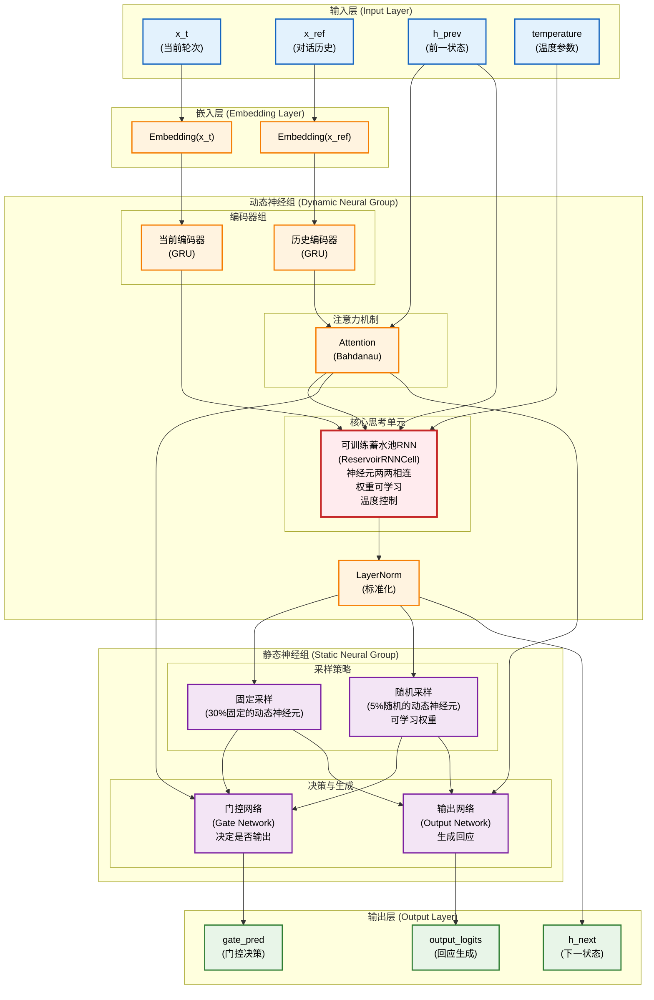

# HGD-MemNet: 分层门控对话记忆网络

本项目是 **分层门控动态记忆网络 (Hierarchical Gated Dynamic Memory Network)** 的一个 PyTorch 实现，旨在解决开放域对话系统中长程依赖的建模问题及模型的输入-输出的实时性问题。模型的核心思想是通过一个分层的门控机制，在不同的时间尺度上动态地更新和维持对话记忆。

## 核心特性

*   **分层门控记忆模型**: 核心模型 `HGD_MemNet` 包含：
    *   **动态神经组 (Dynamic Neural Group)**: 通过循环隐藏状态 `h` 捕获对话的短期记忆，在每个“思考步骤”中进行演化。动态神经组中的神经元两两相连，其中的数据会在模型启动的时候不断进行数据交换，类似蓄水池网络，但是该网络在动态神经组中的权重是可训练的，目前的训练思路是每进行一次数据交换（即一个时间步）就进行一次损失计算以及反向传播且随着对同一输入的反向传播修改的参数（即学习率）会逐步降低，这样来令模型随着思考深入逐渐靠近答案。新增：x_t 的独立 GRU 编码器、LayerNorm 和温度退火支持。
    *   **静态神经组 (Static Neural Group)**: 分为两部分一部分，一部分与固定的30%的动态神经组的神经元相连接，一部分则随机与5%数量的动态神经组的神经元相连接，用于提取整个对话历史的全局上下文表示。新增：可学习随机采样权重。
    *   **门控机制**: 一个门控单元负责在每个步骤中决策是继续“思考”（更新短期记忆）还是生成回应，当门控机制判断需要生成回应的时候想静态神经组输出一个激发，由静态神经组来输出。注：在模型生成回应的时候模型仍然会继续思考,即动态神经组仍然会继续数据交换。

## 模型架构

为了更直观地理解 HGD-MemNet 的工作流程，下图展示了其核心组件之间的数据流和分层门控机制：



## 项目结构

```
HGD-MemNet/
├── .gitignore
├── LICENSE
├── README.md
├── config.py                 # 统一的配置文件 (学习率, 路径, 模型维度等)
├── requirements.txt          # 项目依赖
├── 新的想法.txt              # 模型优化思路和创新想法
├── src/
│   ├── model.py              # HGD_MemNet 模型的核心定义
│   ├── dataset.py            # 高效的二进制数据集加载器 BinaryDialogueDataset
│   ├── prepare_binary_data.py  # 将 .jsonl 转换为分块二进制数据的预处理脚本
│   ├── train.py              # 主训练脚本
│   ├── evaluate.py           # 模型评估脚本
│   ├── chat.py               # 与训练好的模型进行交互式聊天的脚本
│   ├── chat_web.py           # Web界面聊天脚本
│   ├── utils.py              # 工具函数
│   └── tests/                # 测试套件
│       ├── test_model.py     # 模型测试
│       ├── test_training.py  # 训练测试
│       └── ...               # 其他测试文件
└── 辅助脚本/
    ├── check_partial.py      # 检查部分文件
    ├── cleanup_partial_files.py  # 清理部分文件
    ├── count_processed_dialogues.py  # 统计处理的对话数量
    └── quick_count.py        # 快速计数
```

## 环境设置与使用指南

### 1. 克隆仓库

```bash
git clone https://github.com/raw-poplar/HGD-MemNet.git
cd HGD-MemNet
```

### 2. 安装依赖

建议在一个虚拟环境中安装。

```bash
pip install -r requirements.txt
```

### 3. 准备数据

1.  将您的原始对话数据集（例如 LCCC 数据集的 `train.json`, `valid.json`）放置在某个目录下。假设您放到了 `raw_data/` 中。

2.  **重要**: 修改 `config.py` 文件，更新以下路径变量以指向您的数据位置：
    *   `RAW_DATA_DIR`: 指向您存放原始数据的地方 (例如 `'raw_data/'`)。
    *   `LCCC_PROCESSED_PATH`: 指向您希望存放预处理后的二进制数据的目录 (例如 `'processed_data/'`)。

3.  运行数据预处理脚本。该脚本会读取 `RAW_DATA_DIR` 中的数据，并将其处理后保存到 `LCCC_PROCESSED_PATH`。

    #### 方法1: 使用统一入口（推荐）
    ```bash
    # 完整的数据处理流程
    python -m src.data_processing.main --full-pipeline --workers=4

    # 或者交互模式
    python -m src.data_processing.main
    ```

    #### 方法2: 分步执行
    ```bash
    # 步骤1: 数据转换
    python -m src.data_processing.prepare_binary_data --num_workers=4

    # 步骤2: 数据合并
    python -m src.data_processing.merge_tools --method=optimized --dataset=all

    # 步骤3: 验证结果
    python -m src.data_processing.merge_tools --verify
    ```

    运行完毕后，您的 `processed_data/` 目录下应该会看到 `train.pt`, `valid.pt`, `test.pt` 文件和一个 `vocabulary.json`。

### 4. 开始训练

直接运行训练脚本即可。脚本会自动从 `config.py` 中配置的检查点目录加载最新的检查点，并继续训练。

```bash
python -m src.train
```

*   训练日志、验证损失和检查点会保存在 `config.CHECKPOINT_DIR` 指定的目录中。
*   表现最好的模型会被额外保存到 `config.BEST_MODEL_DIR`。

### 5. 评估模型

运行评估脚本来测试模型在测试集上的性能。

```bash
python -m src.evaluate
```

### 6. 与模型聊天

使用 `chat.py` 脚本与您训练好的最佳模型进行交互。

```bash
python -m src.chat  # 命令行交互

# 或者使用 Web 接口：
streamlit run src/chat_web.py  # Web 演示
```

## 改进与优化

- **训练优化**：实现了温度退火（从高到低衰减）和硬/软采样切换，以提升探索性和稳定性。
- **架构增强**：添加了 x_t 的独立编码器、可学习采样权重和 LayerNorm，以提高模型鲁棒性和效率。
- **建议**：监控温度参数，实验不同衰减率；对于大模型，考虑分布式训练。

## 原创性声明
本项目提出的 **HGD-MemNet** (分层门控对话记忆网络) 及其配套技术方案，由作者 [raw-poplar](https://github.com/raw-poplar) 原创设计并实现，若需使用请标上原作者。其核心创新点在于：

- 提出了一种新颖的分层门控动态记忆架构，包含可进行权重学习的动态神经组 (DNG) 和负责全局上下文的静态神经组 (SNG)，通过门控单元协调记忆更新与回应生成。

- 创新性地设计了动态神经组的可训练数据交换机制及其按时间步渐进式训练策略，使模型能在思考过程中逐步逼近最优解。
本项目代码、模型架构及相关技术方案均为原创成果。

## 许可证

本项目采用 [Apache License 2.0](LICENSE) 许可证。 

## 测试

运行 pytest 测试：
pytest src/tests/ 
